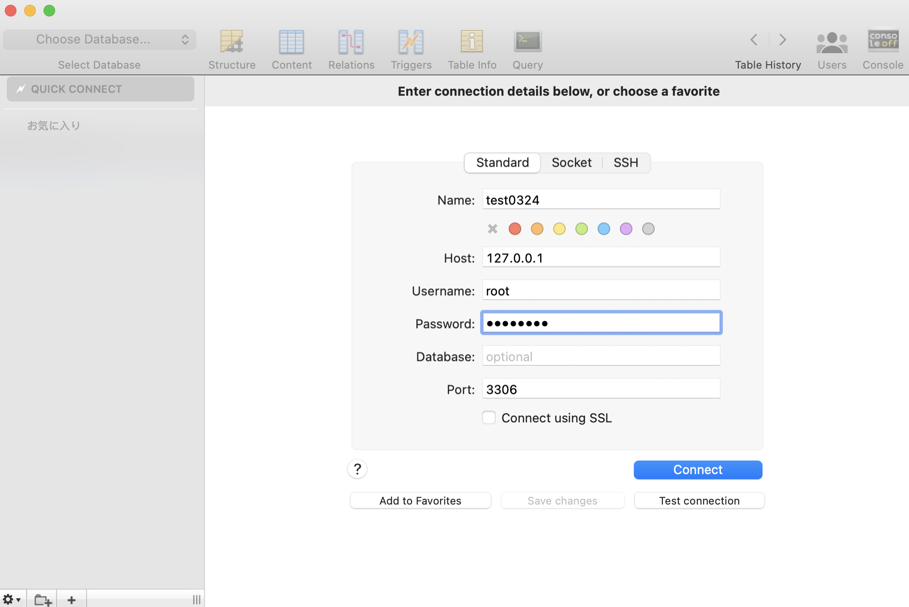
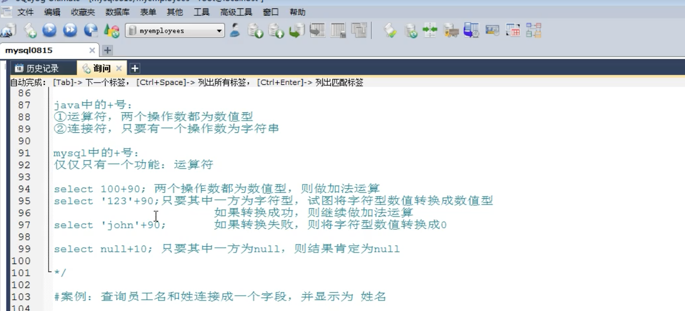
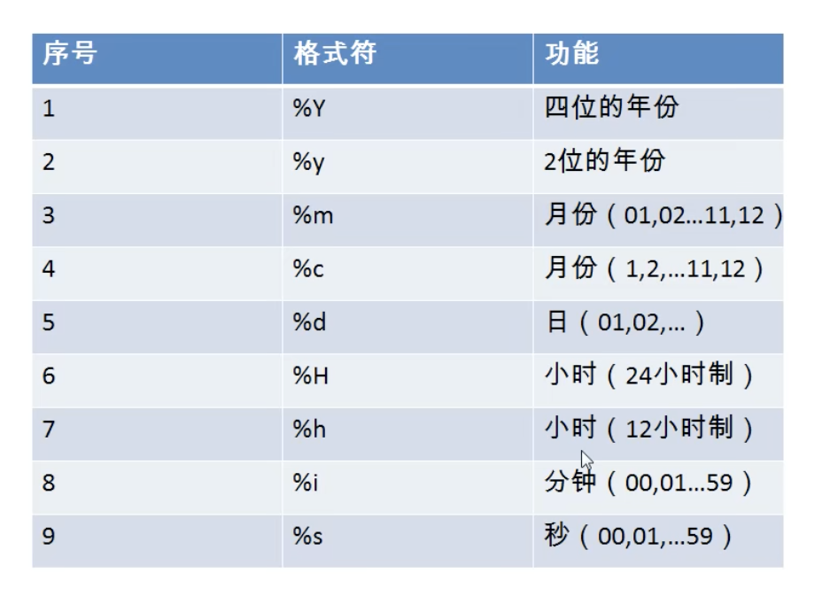
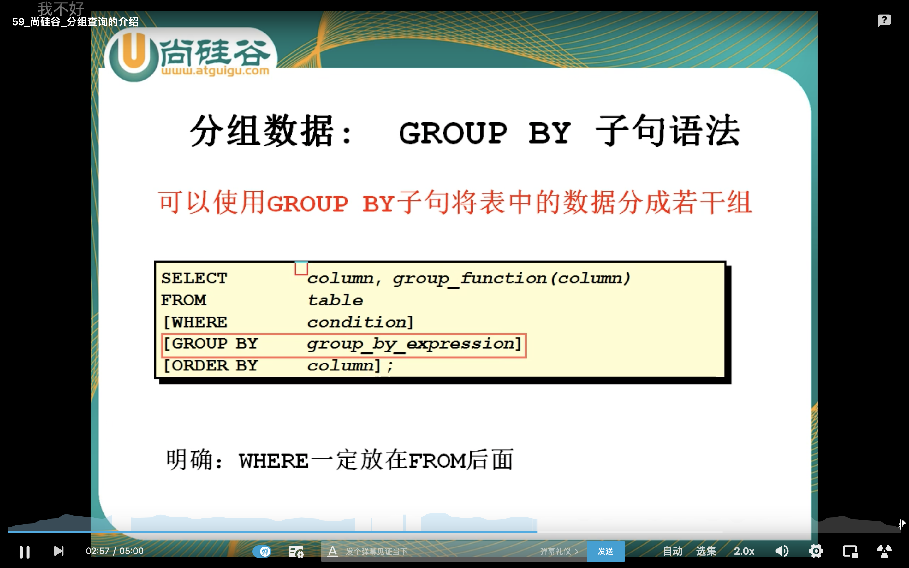
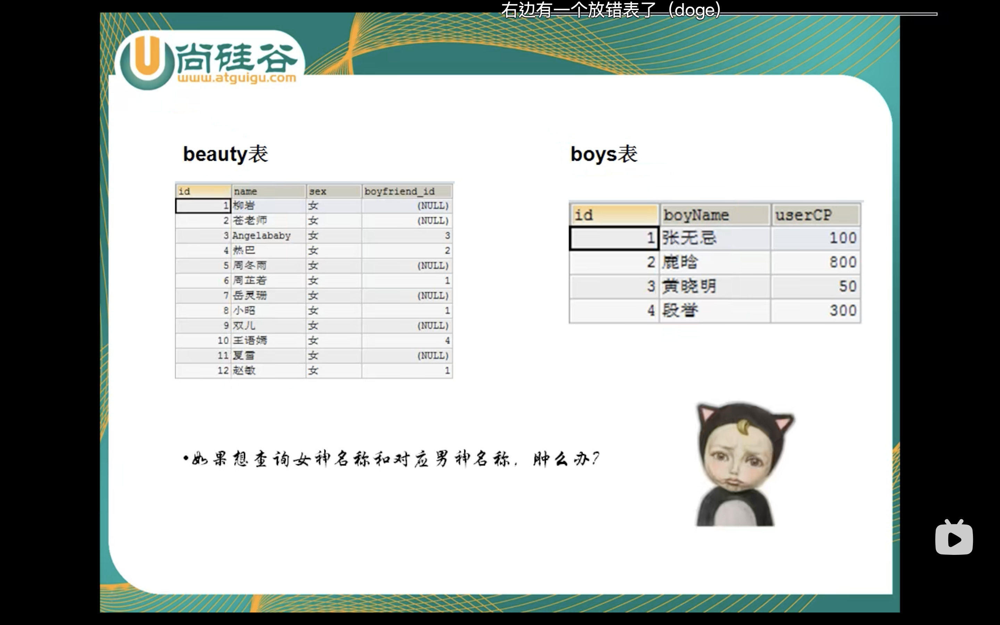
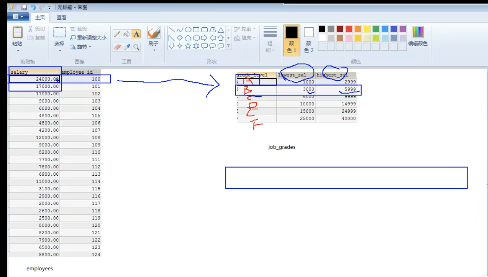
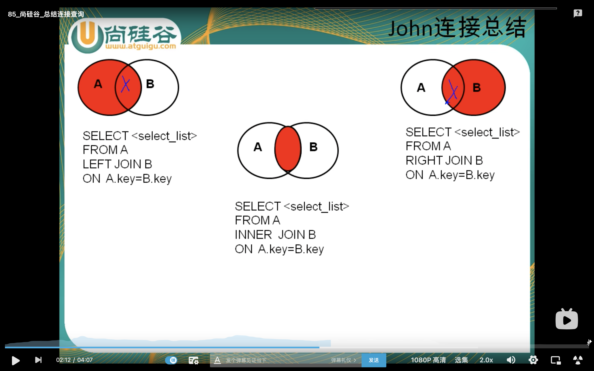

# 4.DQL语言基础



# 1、基础查询

```sql
#进阶1:基础查询
/*
语法
select 查询列表
from 表名

1、查询列表可以是：表中的字段、常量值、表达式、函数
2、查询的结果是虚拟的表格

*/

#先打开所要查询的库

USE myemployees;

#1、查询表中的字段
select last_name from employees;

#2、查询表中多个字段
select last_name,salary,email from employees;

#3、查询表中所有字段
select * from employees;

#4、查询常量值
select 100；
select 'join';

#5、查询表达式
select 100*98;

#6、查询函数
select version()；

#7、为字段起别名
/*
1、便于理解
2、如果要查询的字段有重名的情况 as可以区分它们
*/
#方式一：使用AS
select 100*98 AS 结果;
select last_name AS 姓, first_name As 名 from employees;
#方式二：使用空格
select last_name 姓, first_name 名 from employees;
#案例：查询salary，显示结果为output
#select salary as out put from employees;
select salary as 'out put' from employees;

#8、去重
#案例 查询员工表中涉及到的所有部门编号
select distinct department_id from employees;

#9、+号的作用
/*
java中+号的作用
1、运算符：两个操作数都为数值型
2、连接符：只要有一个是字符串

mysql中+号的作用
只有一个功能 就是运算符
select 100+99; 两个操作数都为数值型
select '123'+99; 试图将字符型转换成数值型

*/
#案例 查询员工行和名并连接成一个字段 显示姓名
select first_name+last_name
from employees;

#9、拼接
select concat(first_name, last_name) as name
from employees;

#案例练习 选择奖金 判断null
select 
concat(`first_name`,',',`last_name`,',',`job_id`,',',IFNULL(conmission,0)) as job_id
from employees;
```



# 2、条件查询

```sql
#进阶2:条件查询
/*
语法：
select 查询列表
from 表名
where 筛选条件;

分类：
	1、按条件表达式筛选
	条件运算符 > < = !=(还可以写成<>) >= <=
	2、按逻辑表达式筛选
	逻辑运算符 && || !
					and or not 比较标准
	3、模糊查询
					like
					between and
					in 
					is null
*/

#三、模糊查询
SELECT first_name
FROM employees
WHERE first_name LIKE 'S%';

/*
like一般和通配符搭配使用
	通配符 
	%：任意多个字符 包含0个字符
	_：下划线 代表任意单个字符

*/

#指定转义字符
where last_name LIKE '_$_%' ESCAPE '$';
#这里其实/一直就是转义字符的意思 但也可以指定别的

/*
BETWEEN AND
1、可以提高语句简洁度
2、包含临界值
3、两个临界值不要调换顺序
*/

/*
IN
用于判断字段的值是否属于in列表中的某一项
特点：
1、比用or提高了语句的简介度
2、in列表的值必须统一或兼容
3、不支持列表中使用通配符 in是等于 通配符是like
*/

/*
IS NULL
特点
=或者<>不能用于判断null值
IS NULL和IS NOT NULL可以判断
*/

/*
安全等于 <=>
is null判断null值 可读性较高（建议用）
<=>可以判断null和数值 可读性较低
*/
```

# 3、排序查询

```sql
#进阶3:排序查询

/*
语法
select 查询列表
from 表名
【where 筛选条件】
order by 排序列表【asc或desc】

特点：
1、asc代表升序，desc代表降序
如果不写，默认是升序
2、order by子句可以支持单个字段排序、多个字段、函数、表达式和别名（见笔记的案例）
3、order by子句一般放在查询语句的最后面，但是limit要放在更后面

*/

```

# 4、常见函数

```sql
#进阶4：常见函数
/*
功能：类似于java中的方法、将一组逻辑语句封装在方法体中，对外暴露方法名
好处；
1、隐藏了实现细节
2、提高了代码的重用性
调用：select 函数名()【from 表】；

特点：
1、叫什么 函数名
2、干什么 函数功能

分类：
1、单行函数
concat length ifnull等
2、分组函数（主要做统计使用）
输入一组值，输出一个值。
又称为统计函数、聚合函数、组函数。
*/
```




## A.单行函数

```sql
#一、字符函数

#1 length 获取参数的字节个数
select length('john');

#2 concat 拼接字符串
select concat(last_name,'_',first_name) 姓名 from emplyees;

#3 upper lower 大小写
select upper('john');    --JOHN

#4 substring substr 截取字符串
#索引从1开始
select substr('李莫愁爱上了陆展元'，7) out_put;
#输出： 陆展元

#后面的3是字符长度，不是位置了，从1开始（1是第一个位置）
select substr('李莫愁爱上了陆展元',1,3) out_put;
#输出： 李莫愁

#5 instr 返回字串第一次出现的索引，如果找不到则返回0
select instr('杨不悔爱上了殷六侠','殷六侠') out_put;
from employees;
#输出： 7

#6 trim
##去掉空格
select length(trim('   张翠山   ')) as out_put;
#输出： 9

select trim('a' from 'aaaaaaaaa张aaaaaa翠山aaaaaa') as out_put;
#标注一下于是去掉了前后的a
#输出： 张aaaaaa翠山 

select trim('aa' from 'aaaaaaaaa张aaaaaa翠山aaaaaa') as out_put;
#标注一下于是去掉了前后的a
#输出： a张aaaaaa翠山 

#7 lpad 用指定的字符实现左填充指定长度
select lpad('殷素素',10,'*') as out_put;
##不够的话左边星号填充
#输出： *******殷素素

#也可以用来截取
select lpad('殷素素',2) as out_put;
#输出： 殷素

#8 rpad 用指定的字符实现左填充指定长度
select rpad('殷素素',12,'ab') as out_put;
##不够的话右边星号填充
#输出： 殷素素ababababa

#9 replace 替换字符
select replace（'周芷若周芷若周芷若张无忌爱上了周芷若','周芷若','赵敏'）as out_put;
#输出： 赵敏赵敏赵敏张无忌爱上了赵敏

#二、数学函数

#1 round 四舍五入
#2 ceil 向上取整
#3 floor 向下取整
#4 truncat 截断，小数点后n位
select truncat(1.666,1);
#output:1.6
#5 mod 取余
select(10,3);

#三、日期函数

#now 返回当前系统日期和时间
select now();

#curdate 返回系统日期 不包含时间
select curdate();

#curtime 返回当前时间 不包含日期

#获取指定的年，月，日，小时，分钟，秒
select year(now()) 年;
select year('1998-01-01') 年;
select month(now()) 月;
select monthname(now()) 月;  #显示英文的月

#str_to_date

select str_to_date('1998-3-2','%Y-%c-%d') as out_put;
#output: 1009-03-02

#date_format

#四、其他函数
select version();
select database();  #查看当前库
select user();  #当前用户

#五、流程控制函数
#1、if函数：if else 的效果（类似三元运算符）

#2、case函数
#效果一：switch case效果
/*
switch(变量表达式)

{java中的应用
switch（变量或表达式）
	case 常量1: 语句1 ;break;
	...
	default: 语句n ;break;}

mysql中
case 要判断的字段或者表达式
when 常量1 then 要显示的值1或者语句1;
when 常量2 then 要显示的值2或者语句2;
...
else 要显示的值n或者语句n;
end
*/

#效果二：类似于多重if
/*
{java中的应用
if（条件1）{
		语句1
}else if（条件2）{
		语句2
...
}else{
		语句n
}

mysql中

case
when 条件1 then 要显示的值1或者语句1;
when 条件2 then 要显示的值2或者语句2;
...
else 要显示要显示的值n或者语句n;
end

*/

```

B.分组函数

```sql
#二、分组函数

/*
功能：
在统计中使用
聚合函数 统计函数 组函数
分类：
sum 求和
avg 平均值
max 最大值
min 最小值
count 计算个数

特点：
1、sum和avg一般用于处理数值型
	max min count可以处理任何类型
2、以上函数全部忽略null值
3、可以和distinct搭配实现去重

*/

#1、简单的使用
select sum(salary) from mployees;

#2、参数支持哪些类型

#3、是否忽略null值

#4、distinct的用法

#5、count函数的详细介绍
一般使用count(*)来统计行数
select count(salary) from employees;
select count(*) from employees;  #统计行数
#任意一行有数的话就加一 所以是整个表的行数
select count(1) from employees; #统计行数

#6、和分组函数一同查询的字段要求是group by后的字段
select avg(salary), employ_id from employees;
#没有任何意义，只会显示一行数，是avg的结果
```

# 5、分组查询

```sql
#进阶5:分组查询

/*

引入：查询每个部门的平均工资

语法：
	select 分组函数，列（要求出现在group by的后面）
	from 表
	【where 筛选条件】
	group by 分组列表
	【order by 子句】  #排序
	【having 分组后的条件】

注意：
		查询列表很特殊，要求是分组函数和group by后面出现的东西
		where 要放在from的后面，group by的前面
		添加分组后的筛选用having不能用where

特点：
1、分组查询的筛选条件分为两类：
									数据源           位置
	分组前筛选       原始表           group by子句的前面 where
	分组后筛选       分组后的结果集    group by子句的后面 having

分组函数做条件肯定放在having子句中

2、能用分组前筛选的就用分组前筛选（优先）
3、group by语句支持单个字段分组，多个字段分组（没有顺序要求），表达式或者函数（用得较少）
4、添加排序order by放在整个排序的最后

*/
```



# 6、连接查询

```sql
#进阶6：连接查询
/*

含义：又叫多表查询
当要查询的字段涉及多个表，就会用到连接查询

笛卡尔乘积现象：
表1有m行，表2有n行，结果是m*n行。
发生原因：没有有效的连接条件
如何避免：添加有效的连接条件

分类：
按年代分类：sql92（仅仅支持内连接） sql99【推荐】（内+外的左外和右外+交叉）
按功能分类：内连接（等值连接、非等值连接、自连接），外连接（左外连接、右外连接、全外连接），交叉连接（也许就是笛卡尔积）

*/

#一、sql92标准
#1、等值连接

/*
提高了语句的简洁度
区分多个重名的字段
注意：如果起了别名，那么查询的字段就不能使用原来的表名了

特点：
1、多表的等值连接是多表的交集部分
2、n个表连接至少需要n-1个连接条件
3、多表的顺序没有要求
4、一般需要为表起别名
5、可以搭配前面介绍的所有查询子句使用（排序、分组、筛选）

#2、可以为表其别名（表名太长的话） 笔记p16
#3、两张表的顺序可以调换
#4、可以加筛选(p16)
#5、可以加分组
#6、可以加排序
#7、可以实现三表连接
*/

#2、非等值连接（只是不是等于号，可以用between and之类的）
#3、自连接

#二、sql99语法
/*
语法： 
select 查询列表
from 表1 别名 【连接类型】
join 表2 别名 
on 连接条件
【where 筛选条件】
【group by 分组】
【having 筛选条件】
【order by 排序列表】

分类：
内连接☆ inner
外连接（左外☆left outer 【outer 可以省略】
			右外☆ right outer
			全外） full 【outer】
交叉连接 cross
*/

#一、内连接
#一）等值连接（p18-19）
/*
语法：
select 查询列表
from 表1 别名 【连接类型】
inner join 表2 别名 
on 连接条件

分类：
等值连接
非等值连接
内连接

特点：
1、添加排序、筛选、分组
2、inner可以省略
3、筛选条件放在where后面，连接条件放在on后面、提高分离型便于阅读
4、inner join的连接和sql92中的内连接是一样的，都是查询多表的交集
*/

#二）非等值连接
#三）自连接

#二、外连接
/*
功能：
查询一个表中有一个表中没有的记录
特点：
1、外连接的查询结果是主表中的所有记录
	如果主表中有可以匹配的，那么就显示该值
	如果没有匹配的列，那就显示null
外连接查询结果=内连接+主表中有而从表中没有的记录
2、左外连接，left join左边的是主表
	右外连接，right join右边是主表
3、左外和右外可以实现一样的效果
4、全外连接=内连接结果+表1中有表2中没有的结果+表2中有表1中没有的结果
*/

#三、交叉连接（笛卡尔乘积）

#sql92和sql99的比较
#功能：支持的较多
#可读性：sql99实现了连接条件和筛选条件的分离，可读性较高
 
```









# 7、子查询

相对来说最有难度的一个查询

```sql
#进阶7:子查询
/*
含义：
出现在其他语句中的select语句，被称为子查询或者内查询
外部的查询语句成为主查询或者外查询

分类：
按自查询出现的位置：
		select后面：
				仅仅支持标量子查询
		from后面:
				支持表子查询
		where或者having后面：
				标量子查询---单行 ☆
				列子查询、行子查询---多行　☆
				（所以是重点）
		exists后面（相关子查询）：
				表子查询
按结果集的h行列数不同：
		标量子查询（结果集只有一行一列）
		列子查询（结果集只有一列多行）
		行子查询（结果集有一行多列）
		表子查询（结果集一般为多行多列）

*/

#一、where或having后面
/*
分类：
1、标量子查询（单行子查询）
2、列子查询（多行子查询）
3、行子查询（多列一行）

特点：
1、子查询放在小括号内
2、子查询一般放在条件的右侧
3、标量子查询，一般配合单行子查询使用
> < >= <= = <>
列子查询，一般配合多行操作符使用
IN、ANY/SOME、ALL
4、子查询的优先级都是大于主查询的，主查询的条件用到了子查询的结果

*/

#1、标量子查询
#非法使用标量子查询

#2、列子查询（多行子查询）p22 重点

#3、行子查询（一行多列或者多行多列）p23

#二、select后面的子查询
/*
仅仅支持标量子查询（一行一列）
*/

#三、from后面的子查询
/*
将子查询结果充当一张表，结果必须起别名
*/

#四、exist后面的子查询（相关子查询）
/*
语法：
exist（完整的查询语句）
返回0或者1
也就是没有或者有
*/
```


# 8、分页查询（使用广泛，比较简单）

```sql
#进阶8:分页查询
/*
使用场景：
当要显示的数据一页显示不全，则分页显示查询结果。

语法：
select 查询列表
from 表名
【join type join 表2
on 连接条件
where 连接条件
group by 分组字段
having 分组后的筛选
order by 排序的字段】
limit 【offset,】size;

offset：要显示条目的起始索引（从0开始） 可以省略
size：要显示的条目个数

特点：
1、limit语句放在查询语句的最后
2、公示：要显示的页数是page，每页的条目数是size
那么：
limit (page-1)*size,size;

*/

```

# 9、联合查询

```sql
#进阶9:联合查询

/*
union 联合 合并：将多条查询语句的结果合并成一个结果

语法：
查询语句1
union 
查询语句2

应用场景：
要查询的结果来自多个表
且要查询的结果之间没有连接关系
但查询的信息一致

特点：
1、要求多条查询语句的查询列数是一致的！
2、要求多条查询语句查询每一列的类型和顺序最好是一致的！
3、union默认去重，union all是并集，包含了重复项

*/
```