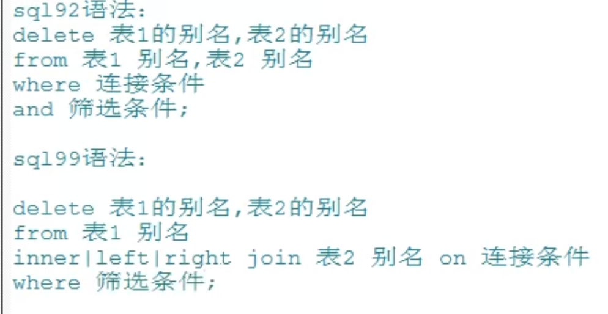

# 5.DML语言基础

```sql
/*

数据操纵语言
插入 insert
修改 update
删除 delete

*/
```

# 一、插入语句

```sql
/*
方式一
insert into 表名（列名：字段名，...） values(值1,值2,...);

方式二
insert into 表名
set 列名=值,列名=值,...

两种方式大比较
1、方式一支持插入多行，方式二不支持
2、方式一支持子查询，方式二不支持

*/

#1、插入值的类型要与列的饿类型一致或者兼容 p25
#2、不可以为null的列必须插入值，可以为null的列是如何插入值的？
#方式一：直接写null。
#方式二：直接不写列了。
#3、列的顺序可以调换
#4、列数和值的个数必须一致
#5、可以省略列名，默认是所有列，且列的顺序和表中顺序是一致的

```

# 二、修改语句

```sql
#二、修改语句

/*
1、修改单表记录【重要】
语法：
update 表名
set 列=新值,...
where 筛选条件;

2、修改多表记录【补充】
sql92：
update 表1 别名，表2 别名
set 列=新值
where 连接条件
and 筛选条件;

sql99:
update 表1 别名
inner/left/right join 表2 别名
on 连接条件
set 列=新值
where 筛选条件;

*/
```

# 三、删除语句

```sql
#二、删除语句（面试题）

/*
单表删除
方式一：
语法
delete from 表名
where 筛选条件
（删除整行，如果不加条件那么删除整个表）

方式二：truncate
语法
truncate table 表;
（删除的是整张表）
语句中不许加where

多表删除
见图

区别：
1、delete可以加where，truncate不可以
2、truncate删除效率稍微高一点
3、如果删除的表中有自增长列
如果用delete删除后，在插入数据，那么自增长列的值从断点开始。
如果用truncate删除后，在插入数据，那么自增长列的值从1开始。
4、truncate删除没有返回值，delete删除有返回值
5、truncate删除无法回滚，delete可以
*/

#
```

