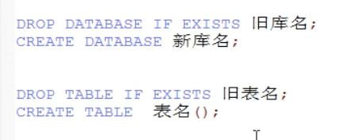
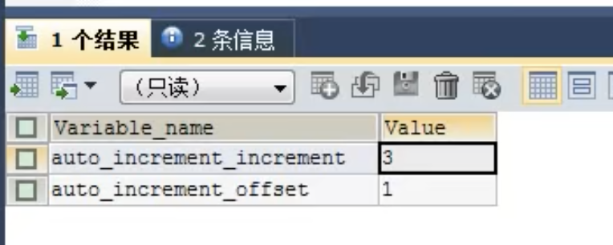

# 6.DDL语言基础

data definition language

# 一、库的管理

```sql
/*
数据定义语言

库和表的管理

一、库的管理
创建，修改，删除
二、表的管理
创建，修改，删除

创建 create
修改 alter
删除 drop

*/

#一、库的管理
#1、库的创建
/*
语法
create databaes 【if not exists】 库名;
*/

create database if not exists books;

#2、库的修改（一般不修改）
RENAME DATABASE books to 新名字;
#更改库的字符集
alter database books character set gdk;

#3、库的删除
drop database if exists books;

```

# 二、表的管理

```sql
#二、表的管理

#1、表的创建
/*
语法

create 表名(
		列名 列的类型【(长度)约束】,
		列名 列的类型【(长度)约束】,
		...
		列名 列的类型【(长度)约束】
);

*/

#2、表的修改
/*
语法：
alter table 表名 add/drop/modify/change column 列名 【列类型 约束】;

*/

#a、修改列名
alter table books change column publishdate pubDate datetime;

#b、修改类型或约束
alter table books modify column pubDate timestamp;

#c、添加列
alter table author add column annual double;

#d、删除列
alter table author drop column annual;

#e、修改表名
alter table author rename to book_author;

#3、表的删除
drop table if exists author;
show tables;
#查看当前库的所有表

#4、表的复制
#1、仅仅复制表的结构
create table copy like books;
#copy继承了books的结构，但其中没有数据

#2、复制结构外加数据
create table copy2
select * from author;

#3、只复制部分数据
create table copy3
select id,name
from author
where nation='china';

#4、仅仅复制某些字段
create table copy3
select id,name
from author
where 1=2;（或者写where 0）
#把条件设置为谁都不满足就可以单独复制表头了
```



# 二、常见数据类型的介绍

```sql
#常见数据类型
/*
数值型：
	整型
	小数（浮点数，定点数）

字符型：
	短文本 char varchar
	长文本 text blob（较长的二进制数）

日期型：

*/

#一、整型
int #默认都是有符号，可以是负数
int unsigned #都得是正数

/*
分为5类（见下面的图）
特点：
1、默认有符号，设置无符号用unsigned 
2、插入数值超出范围，会报错out of range，并插入临界值
3、如果不设置长度，会有默认的长度
长度代表了显示的最大宽度，如果不够会用0在左边填充，但必须搭配zerofill使用
*/

#二、小数

/*
1、浮点型
float(M,D)
double

2、定点型
dec(M,D)
decimal(M,D)
如果是decimal的话，那么M默认为10，D默认为0
如果是float和double，会根据插入数值的京都来确定精度
3、定点型精确度较高，货币运算中使用；其余浮点型就可以了（float）。

特点：
1、M：整数部位+小数部位
D：小数部位
如果超过范围那么插入临界值
2、M和D都可以省略

*/

#原则
#所选的类型越简单越好

#三、字符型
/*
较短的文本：
char 
varchar

较长的文本
text
blob（较长的二进制）

M是最大的字符数（一个汉字就是一个字符）

其余：
binary和varbinary 用于保存较短的二进制
ENUM 枚举型
SET 用于保存集合

*/

#四、日期型
/*
date只保存日期
time 只保存时间

*/
```





# 三、常见约束

```sql
#常见约束

/*
含义：
限制表格中的数据，诶了保证表格中书库的准确性和可靠性。

分类：
六大约束
		·not null：用于保证该字段的数不能为空
		比如 姓名、学号
		·default：默认 用于保证该字段有默认值
		比如性别
		·primary key：主键 保证该字段的值有唯一性，而且非空
		比如学号、员工编号
		·unique：唯一，保证唯一性，可以为空
		比如座位号，手机，邮箱等等
		·check：检查约束【mysql中不支持】
		比如年龄、性别  
		只有满足某种条件的才能添加，比如年龄不能小于0
		·foreign key：外键，用于限制两张表的关系，用于保证该字段的值必须来自于主表的关联列的值。
				在从表添加外键约束用于引用主表某列的值
		比如学生表的专业编号，员工表的工种编号

添加约束的时机：
（数据添加之前）
1、创建表时
2、修改表时

约束的添加分类：
1、列级约束
		六大约束语法上都支持，但是外键约束没效果
2、表级约束
		除了非空、默认，其余都支持

主键和唯一的大对比：
			保证唯一性   是否允许为空   一个表中可以有多少个  是否允许组合
主键    是        否             最多一个            允许，但不推荐
唯一    是        是             可以有多个          允许，但不推荐

外键：
1、要求在从表设置外键关系
2、从表的外键列的类型和主表的关系列的类型要求一致或兼容，但名字不一定要一致。
3、要求主表的关联列必须是一个key（一般是主键或者唯一）
primary key或者unique
4、插入数据时，先插入主表然插入从表的数据；
删除数据先删除从表，再删除主表数据。

*/

create table 表名(
			字段名 数据类型 列级约束,
			字段名 数据类型,
			表级约束
)

#一、创建表时添加约束
#1、添加列级约束

/*
语法：
直接在字段名和类型后面追加约束类型即可

只支持：默认、非空、主键、唯一
*/

#2、添加表级约束
/*
语法：
添加在各个字段的下面
【constaint  约束名】 约束类型（字段名）
*/

#通用写法

CREATE TABLE IF NOT EXISTS stuinfo(
		id INT PRIMARY KEY,
		stuname VARCHAR(20) NOE NULL,
		sex CHAR(1),
		age INT DEFAULT 18,
		seat INT UNIQUE,
		majorid INT,

		CONSTARINT fk_studinfo_major FOREIGN KEY(majorid) PREFEN|RENCE major(id)
	  #外键
)

 

#二、修改表时添加约束
/*
1、添加列级约束
alter table 表名 modify column 字段名 字段类型 新约束;

2、添加表级约束
alter table 表名 add 【constraint 约束名】 约束类型（字段名） 【外键的引用】;

*/
#1、添加非空约束
alter table stuinfo modify solumn stuname varchar(20) not null;
#2、添加默认约束
alter table stuinfo modify solumn age int default 18;
#3、添加主键
#a.列级约束
alter table studinfo modify column id int primary key;
#b.表级约束
alter table studinfo add primary key(id);
#4、添加唯一
#a.列级约束
alter table studinfo modify column seat int unique;
#b.表级约束
alter table studinfo add unique(seat);
#5、添加外键
alter table studinfo foreign key unique(majorid) references major(id);

#三、修改表时删除约束
#1、删除非空约束
alter table stuinfo modify solumn styname varchar(20) null;
#2、删除默认约束
alter table stuinfo modify column age int;
#3、删除主键
alter table stuinfo modify column id int;
alter table stuinfo drop primary key;（这个好）
#4、删除唯一
alter table stuinfo drop index seat;
show index from stuinfo
#5、删除外键
alter table stuinfo drop foreign key xxxx;

#标识列

/*
又称为自增长列
含义：可以不用手动插入值，系统提供默认的序列值

特点：
1、标识列必须和主键搭配吗？
		不一定，但要求是key（unique key也是key）
2、一个表可以有几个标识列？
		只能有一个自增长列
3、标识列的类型？
		只能是数值型（int float double）
4、可以通过set wuto_increment_increment=3设置步长
也可以通过手动插入值设置其实值
*/

#一、创建表时设置标识列
id int primary key auto_increment
#二、修改表时设置标识列
alter table tab_identity modify column id int primary key auto_increment;
#三、修改表时删除标识列
alter table tab_identity modify column id int primary key;

```

外键用于与另一张表的关联。是能确定另一张表记录的字段，用于保持数据的一致性。比如，A表中的一个字段，是B表的主键，那他就可以是A表的外键。


主键和唯一键的区别

[主键和唯一索引的区别_不胜人生一场醉-CSDN博客_主键索引和唯一索引](https://blog.csdn.net/baoqiangwang/article/details/4832814)